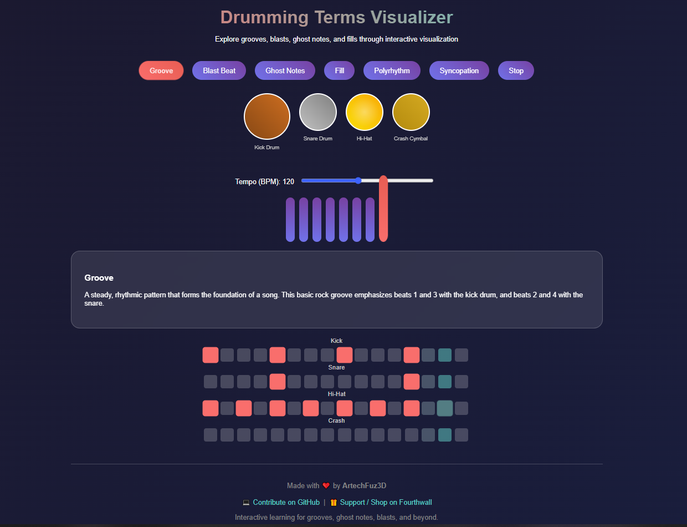

# 🥁 Drumming Concepts Visualizer

**Interactive Tool for Learning Drumming Techniques**  
Created with ❤️ by [ArtechFuz3D](https://shop.artechfuz3d.xyz)

---

## 🎯 Overview

The **Drumming Concepts Visualizer** is an interactive, web-based educational tool for exploring and understanding common drumming patterns and techniques. It offers a visual and audio-based experience for learning grooves, blast beats, ghost notes, fills, polyrhythms, and syncopation.

Whether you're a beginner drummer or an experienced musician, this tool helps break down complex rhythmic concepts through intuitive design and real-time feedback.

---

## 🧠 Features

- 🎵 **Interactive drum pad** with click/tap feedback
- 👁️ **Visual beat bar** representing active rhythms
- 🧩 **16-step pattern grid** per technique
- 🎧 Real-time **audio playback** using the Web Audio API
- 🌀 Pattern types:
  - Groove
  - Blast Beat
  - Ghost Notes
  - Fill
  - Polyrhythm
  - Syncopation
- 🎚️ Adjustable **tempo control**
- 💡 Explanation of each drumming concept
- Responsive design and engaging UI with animations

---

## 🚀 Getting Started

### 📦 Clone the Repository

```bash
git clone https://github.com/ArtechFuz3D/DrummingConceptsVisualizer.git
cd DrummingConceptsVisualizer
```

### 🖥️ Open in Browser

Just open `index.html` in your preferred browser.

Or host it locally with a simple server (e.g., Python):

```bash
# Python 3.x
python -m http.server
```

Visit `http://localhost:8000`

---

## 📸 Screenshots



---

## 💬 Contribute

Want to add more patterns, audio features, or visual polish?

### 👇 Fork & PR

1. Fork this repo
2. Create your branch: `git checkout -b feature-name`
3. Commit your changes: `git commit -m "Added new pattern"`
4. Push to the branch: `git push origin feature-name`
5. Submit a Pull Request

---

## ☕ Support & Donations

If this project helped you learn or you want to support its growth, consider:

- Visiting the shop: [🛍️ shop.artechfuz3d.xyz](https://shop.artechfuz3d.xyz)
- Sending a donation or buying some merch – your support is appreciated!

---

## 🧾 License

This project is open-source and freely available under the **MIT License**.  
See `LICENSE` for more information.

---

## 🔗 Links

- 🌐 **Live Demo:** [artechfuz3d.github.io/drumming-visualizer](https://artechfuz3d.github.io/drumming-visualizer)
- 🛒 **Shop:** [shop.artechfuz3d.xyz](https://shop.artechfuz3d.xyz)
- 🧠 **Creator:** [ArtechFuz3D](https://github.com/ArtechFuz3D)

---

Made with rhythm & passion 🥁
